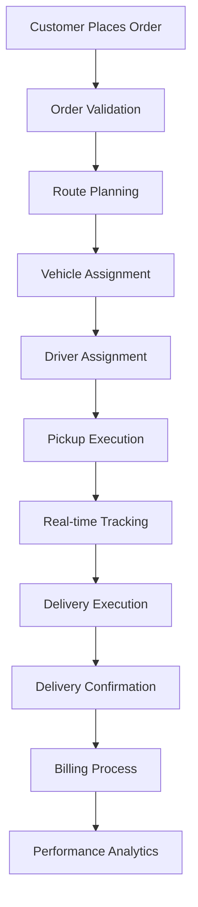
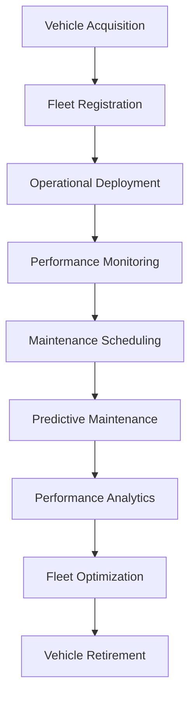
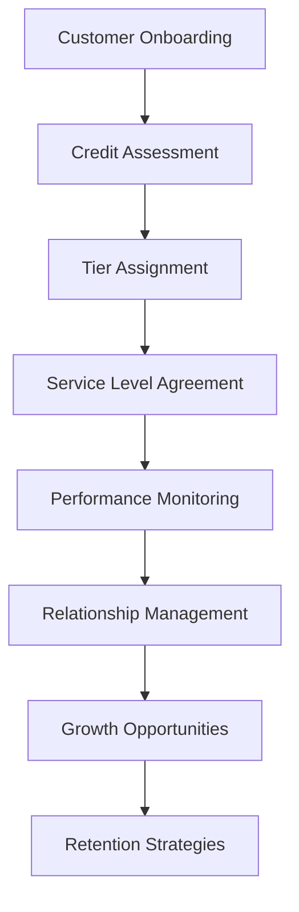
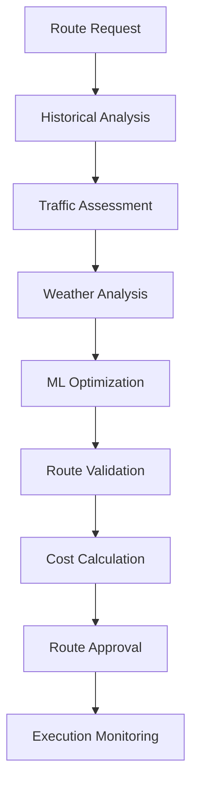
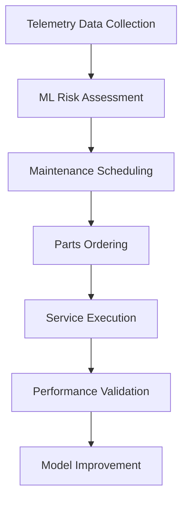
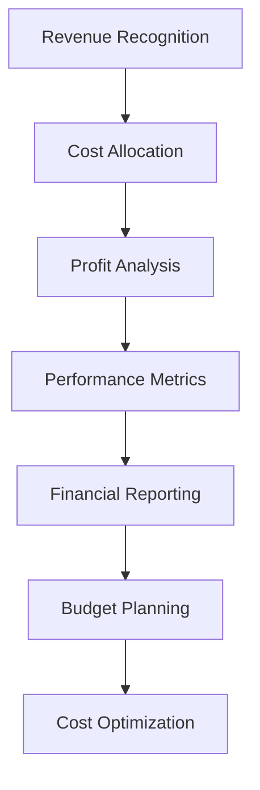
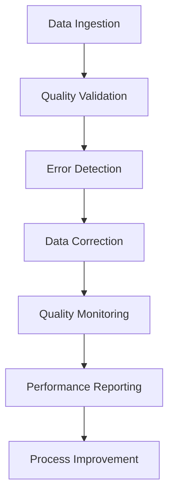
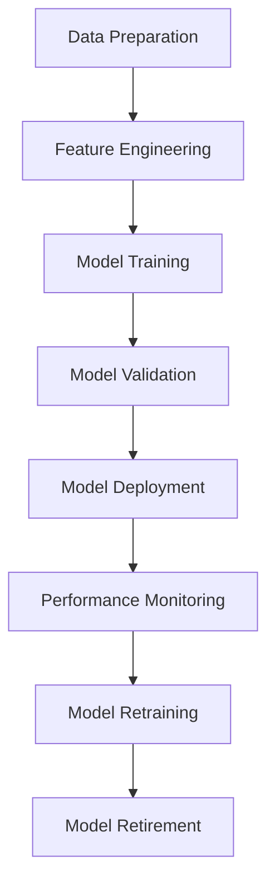

# Business Process Documentation - Logistics Analytics Platform

This document outlines the core business processes supported by the logistics analytics platform, including data flows, decision points, and operational procedures.

## Table of Contents
1. [Business Process Overview](#business-process-overview)
2. [Order to Delivery Process](#order-to-delivery-process)
3. [Fleet Management Process](#fleet-management-process)
4. [Customer Management Process](#customer-management-process)
5. [Route Optimization Process](#route-optimization-process)
6. [Predictive Maintenance Process](#predictive-maintenance-process)
7. [Financial Management Process](#financial-management-process)
8. [Data Quality Management Process](#data-quality-management-process)
9. [ML Model Lifecycle Process](#ml-model-lifecycle-process)

## Business Process Overview

### Core Business Value Chain
```
Customer Order → Route Planning → Vehicle Assignment → Execution → Delivery → Billing → Analytics
```

### Key Business Processes
1. **Order Management**: Customer order processing and validation
2. **Fleet Operations**: Vehicle assignment and route optimization
3. **Delivery Execution**: Real-time tracking and performance monitoring
4. **Customer Service**: Relationship management and satisfaction
5. **Financial Management**: Revenue, costs, and profitability analysis
6. **Maintenance Management**: Predictive and scheduled maintenance
7. **Performance Analytics**: KPI monitoring and business intelligence

## Order to Delivery Process

### Process Flow


### Detailed Process Steps

#### 1. Order Validation
**Input**: Customer order request
**Process**: 
- Validate customer credit limit
- Check vehicle availability
- Verify route feasibility
- Confirm pricing and terms

**Data Sources**:
- `tbl_dim_customer` (credit limit, payment terms)
- `tbl_dim_vehicle` (availability, capacity)
- `tbl_dim_route` (feasibility, distance)

**Business Rules**:
- Credit limit must cover order value
- Vehicle capacity must exceed shipment weight
- Route must be within service area
- Pricing must meet minimum margin requirements

**Output**: Validated order with assigned resources

#### 2. Route Planning
**Input**: Validated order with origin/destination
**Process**:
- Calculate optimal route using ML algorithms
- Consider traffic conditions and weather
- Factor in vehicle specifications
- Optimize for cost and time

**Data Sources**:
- `tbl_dim_route` (base route data)
- `tbl_fact_route_performance` (historical performance)
- Weather and traffic APIs
- `tbl_ml_consolidated_feature_store` (ML features)

**Business Rules**:
- Route efficiency must be > 85%
- Delivery time must meet customer SLA
- Fuel costs must be minimized
- Carbon emissions must be tracked

**Output**: Optimized route with estimated costs and timing

#### 3. Vehicle Assignment
**Input**: Optimized route and shipment requirements
**Process**:
- Match vehicle capacity to shipment needs
- Consider vehicle maintenance status
- Factor in driver availability
- Optimize fleet utilization

**Data Sources**:
- `tbl_dim_vehicle` (capacity, status)
- `tbl_fact_vehicle_telemetry` (maintenance status)
- `tbl_ml_maintenance_features` (predictive maintenance)

**Business Rules**:
- Vehicle capacity must exceed shipment weight by 10%
- Vehicle must be in ACTIVE status
- Maintenance risk score must be < 70
- Driver must be available for route duration

**Output**: Assigned vehicle with driver and route

#### 4. Execution and Tracking
**Input**: Assigned resources and route
**Process**:
- Real-time GPS tracking
- Performance monitoring
- Exception handling
- Customer communication

**Data Sources**:
- `tbl_fact_vehicle_telemetry` (real-time data)
- `tbl_fact_shipments` (shipment status)
- Customer communication systems

**Business Rules**:
- Location updates every 5 minutes
- Performance alerts for deviations
- Customer notifications for delays
- Exception escalation procedures

**Output**: Real-time shipment status and performance data

## Fleet Management Process

### Process Flow


### Key Process Components

#### 1. Vehicle Acquisition and Registration
**Business Rules**:
- All vehicles must meet safety standards
- Insurance and registration must be current
- Vehicle specifications must be documented
- Maintenance schedules must be established

**Data Requirements**:
- Vehicle specifications (make, model, capacity)
- Insurance and registration details
- Initial maintenance schedule
- Performance baselines

#### 2. Operational Deployment
**Process**:
- Vehicle assignment to routes
- Driver assignment and training
- Performance baseline establishment
- Real-time monitoring setup

**Business Rules**:
- Vehicles must be assigned based on capacity and efficiency
- Drivers must be trained on vehicle-specific features
- Performance baselines must be established within 30 days
- Real-time monitoring must be active 24/7

#### 3. Performance Monitoring
**Data Sources**:
- `tbl_fact_vehicle_telemetry` (real-time performance)
- `tbl_fact_shipments` (delivery performance)
- `tbl_ml_rolling_analytics` (trend analysis)

**Key Metrics**:
- Fuel efficiency (MPG)
- On-time delivery rate
- Maintenance costs
- Utilization rate

**Business Rules**:
- Performance must meet or exceed baselines
- Deviations must trigger investigation
- Monthly performance reviews required
- Annual fleet optimization planning

## Customer Management Process

### Process Flow


### Key Process Components

#### 1. Customer Onboarding
**Process**:
- Business verification
- Credit assessment
- Service requirements analysis
- Contract negotiation

**Data Requirements**:
- Business registration and verification
- Financial statements and credit history
- Service level requirements
- Pricing and payment terms

**Business Rules**:
- All customers must pass credit assessment
- Service levels must be clearly defined
- Contracts must include performance metrics
- Onboarding must be completed within 5 business days

#### 2. Tier Assignment and Management
**Tier Criteria**:
- **Platinum**: >$1M annual revenue, >95% on-time rate
- **Gold**: $500K-$1M annual revenue, >90% on-time rate
- **Silver**: $100K-$500K annual revenue, >85% on-time rate
- **Bronze**: <$100K annual revenue, >80% on-time rate

**Business Rules**:
- Tier assignment based on 12-month rolling performance
- Quarterly tier reviews and adjustments
- Service levels must match tier requirements
- Pricing must reflect tier benefits

#### 3. Performance Monitoring
**Key Metrics**:
- On-time delivery rate
- Customer satisfaction score
- Revenue growth
- Payment timeliness

**Business Rules**:
- Performance reviews monthly
- Tier adjustments quarterly
- Customer satisfaction surveys quarterly
- Retention strategies for at-risk customers

## Route Optimization Process

### Process Flow


### Key Process Components

#### 1. Historical Analysis
**Data Sources**:
- `tbl_fact_route_performance` (historical performance)
- `tbl_ml_rolling_analytics` (trend analysis)
- `tbl_fact_shipments` (delivery outcomes)

**Analysis Components**:
- Average delivery times
- Fuel efficiency by route
- Traffic patterns
- Weather impact

#### 2. Real-time Optimization
**ML Models**:
- Route efficiency prediction
- Traffic delay forecasting
- Weather impact assessment
- Cost optimization

**Business Rules**:
- Route efficiency must be > 85%
- Delivery time must meet SLA
- Fuel costs must be minimized
- Carbon emissions must be tracked

#### 3. Continuous Improvement
**Process**:
- Performance monitoring
- Route adjustment recommendations
- ML model retraining
- Optimization algorithm updates

**Business Rules**:
- Route performance reviews weekly
- ML model retraining monthly
- Optimization algorithm updates quarterly
- Performance improvements must be measurable

## Predictive Maintenance Process

### Process Flow


### Key Process Components

#### 1. Risk Assessment
**Data Sources**:
- `tbl_fact_vehicle_telemetry` (real-time data)
- `tbl_ml_maintenance_features` (ML features)
- `tbl_dim_vehicle_maintenance` (maintenance history)

**ML Models**:
- Engine failure prediction
- Brake system monitoring
- Fuel system analysis
- Overall vehicle health scoring

**Business Rules**:
- Risk scores calculated daily
- Maintenance alerts for scores > 70
- Emergency maintenance for scores > 90
- Preventive maintenance for scores 50-70

#### 2. Maintenance Scheduling
**Process**:
- Risk-based scheduling
- Parts availability checking
- Service center coordination
- Driver notification

**Business Rules**:
- Maintenance must be scheduled within 48 hours of alert
- Parts must be available before scheduling
- Service must not impact critical deliveries
- Drivers must be notified 24 hours in advance

#### 3. Performance Validation
**Metrics**:
- Maintenance cost reduction
- Breakdown prevention rate
- Vehicle availability improvement
- Fuel efficiency maintenance

**Business Rules**:
- Maintenance effectiveness measured monthly
- ML model accuracy tracked continuously
- Cost savings must be > 20%
- Vehicle availability must be > 95%

## Financial Management Process

### Process Flow


### Key Process Components

#### 1. Revenue Recognition
**Process**:
- Delivery confirmation triggers billing
- Revenue recognized upon delivery
- Customer payment tracking
- Revenue forecasting

**Business Rules**:
- Revenue recognized upon delivery confirmation
- Payment terms must be enforced
- Late payment penalties applied
- Revenue forecasting updated monthly

#### 2. Cost Management
**Cost Categories**:
- Fuel costs (30-40% of total)
- Driver costs (25-30% of total)
- Vehicle maintenance (10-15% of total)
- Overhead costs (15-20% of total)

**Business Rules**:
- All costs must be allocated to shipments
- Cost variances must be investigated
- Budget vs. actual analysis monthly
- Cost optimization targets quarterly

#### 3. Profitability Analysis
**Key Metrics**:
- Gross profit margin
- Net profit margin
- Cost per mile
- Revenue per customer

**Business Rules**:
- Minimum gross margin 15%
- Minimum net margin 5%
- Cost per mile must be optimized
- Customer profitability must be positive

## Data Quality Management Process

### Process Flow


### Key Process Components

#### 1. Data Validation
**Validation Rules**:
- Data type validation
- Range validation
- Referential integrity
- Business rule validation

**Business Rules**:
- All data must pass validation before processing
- Invalid data must be quarantined
- Data quality scores must be > 95%
- Validation failures must be investigated

#### 2. Error Handling
**Process**:
- Error detection and logging
- Data correction procedures
- Exception reporting
- Process improvement

**Business Rules**:
- Errors must be logged with full context
- Data corrections must be approved
- Exception reports generated daily
- Process improvements implemented monthly

#### 3. Quality Monitoring
**Metrics**:
- Data completeness
- Data accuracy
- Data freshness
- Data consistency

**Business Rules**:
- Quality metrics monitored continuously
- SLA breaches trigger alerts
- Quality reports generated daily
- Improvement plans updated monthly

## ML Model Lifecycle Process

### Process Flow


### Key Process Components

#### 1. Model Development
**Process**:
- Data preparation and cleaning
- Feature engineering
- Model training and validation
- Performance testing

**Business Rules**:
- Models must achieve > 80% accuracy
- Validation must use holdout data
- Performance must be measured on business metrics
- Models must be explainable

#### 2. Model Deployment
**Process**:
- Production deployment
- Performance monitoring
- A/B testing
- Rollback procedures

**Business Rules**:
- Models must be deployed with monitoring
- A/B testing required for new models
- Rollback procedures must be tested
- Performance must meet business requirements

#### 3. Model Maintenance
**Process**:
- Performance monitoring
- Drift detection
- Model retraining
- Performance reporting

**Business Rules**:
- Models must be monitored continuously
- Drift detection alerts must be investigated
- Retraining must be scheduled monthly
- Performance reports generated weekly

## Process Integration Points

### Data Flow Integration
- **Real-time**: Vehicle telemetry, shipment tracking
- **Batch**: Financial reporting, performance analytics
- **Streaming**: Route optimization, maintenance alerts

### System Integration
- **ERP Systems**: Customer, vehicle, route data
- **IoT Platforms**: Vehicle telemetry, sensor data
- **External APIs**: Weather, traffic, mapping services
- **BI Tools**: Dashboards, reporting, analytics

### Business Integration
- **Operations**: Fleet management, route planning
- **Finance**: Revenue recognition, cost management
- **Customer Service**: Relationship management, satisfaction
- **Maintenance**: Predictive maintenance, scheduling

## Performance Metrics and KPIs

### Operational KPIs
- On-time delivery rate: > 95%
- Route efficiency: > 85%
- Vehicle utilization: > 80%
- Customer satisfaction: > 4.5/5

### Financial KPIs
- Gross profit margin: > 15%
- Net profit margin: > 5%
- Cost per mile: < $2.50
- Revenue growth: > 10% annually

### Quality KPIs
- Data quality score: > 95%
- Model accuracy: > 80%
- System availability: > 99.5%
- Error rate: < 0.1%

---

**Last Updated**: December 2024  
**Version**: 1.0  
**Owner**: Business Operations Team  
**Review Cycle**: Quarterly
